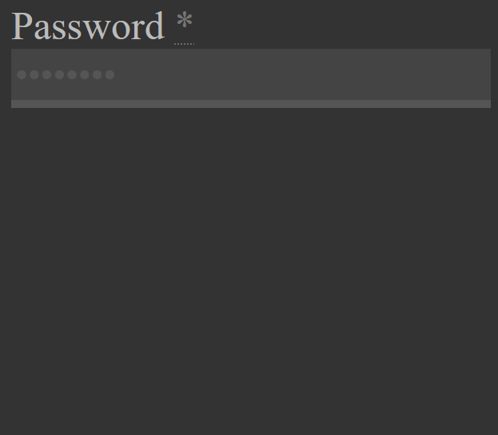

# odin-form

# https://hectorvilas.github.io/odin-form/

<table>
<thead>
<tr>
<th><h2>English</h2></th>
<th><h2>Español</h2></th>
</tr>
</thead>
<tbody>
<tr>
<td style="vertical-align: top;">
Welcome to the project. This time I'm not doing anything special, just some forms practice from <a href="https://www.theodinproject.com/">The Odin Project</a>.

As english is not my native language, from now on I'm going to write everything in english and spanish. I just need to find a way to make it easy to read here in the README.md.

Click in the bottom elements to open or collapse the progress updates in english or spanish (english open by default)
</td>

<td style="vertical-align: top;">
Bienvenido al proyecto. Esta vez no voy a hacer nada especial, sólo una práctica de form de <a href="https://www.theodinproject.com/">The Odin Project</a>.

Ya que el inglés no es mi idioma nativo, a partir de ahora voy a empezar a escribir todo en inglés y español. Solo tengo que encontrar la forma de hacerlo fácil de leer en el README.md.

Haga click en los elementos de abajo para abrir o colapsar la actualización del progreso en inglés o español (inglés abierto pro defecto)
</td>
</tr>
</tbody>
</table>

<!--------------------------->
<!-- spanish version here --->
<!--------------------------->

<strong>ESPAÑOL (CLICK PARA EXPANDIR)</strong>

A medida que progreso con el curso de frontend, y luego de haber leído un montón sobre formularios, es hora de poner todo ese nuevo conocimiento en práctica, por lo que voy a hacer una página de formulario siguiendo <a href="./others/sign-up-form.png">esta imagen de diseño</a>.

<h2>Actualización 1</h2>

Ahora que sé cómo quiero que se vea la página, he descargado unas pocas imágene para que la misma se vea interesante. Luego de eso dediqué demasiado tiempo experimentando con el README.md para mostrar ámbos idiomas. Usé un poco de HTML básico para eso, no sabía que era posible en este tipo de archivos.

<h2>Actualización 2</h2>

Intenté hacer lo que tenía en mente, pero fallé completamente. Mientras pensaba en el proyecto al hacer otras cosas, se me ocurrió una mejor forma de hacer lo que quería lograr, y ahora funciona.

Cuando el usuario hace click en sign up o login, los botones se ocultarán y las imágenes se moverán hacia la derecha o izquierda, revelando el formulario apropiado. Por ahora no hay formularios.

Para hacerlo un poco más interesante, las imágenes en la página aparecerán borrosas y luego se enfocarán, y los botones aparecerán por debajo.

<h2>Actualización 3</h2>

Los botones han sido estilizados un poco, haciendo que el de Sign Up sea más notable que el de Log In. El formulario me llevó algo de tiempo para empezarlo porque tuve algunos problemas con CSS. Por ahora estoy usando el texto por defecto de la muestra de Odin, quizá lo cambie por algo menos genérico en el futuro.

El siguiente paso sería añadir más CSS, placeholders y patterns a los inputs, o el formulario será lo menos profesional que uno podría encontrarse. He llenado algunos feos formularios en los últimos días, y la experiencia de usuario fue horrible. No quiero cometer los mismos errores.

En fin, acá dejo un GIF mostrando el progreso:

<h2>Actualización 4</h2>

El formulario al fin progresa. Me costó encontrar la forma de lograr lo que tenía en mente. Los inputs ahora tienen placeholders, los estilicé un poco y luego me encontré con un problema: ¿cómo puedo hacer que el formulario muestre mensajes de error? Luego de testear un montón, finalmente encontré una forma de mostrar mensajes de error una vez que el usuario deja el input. De esta forma el usuario no será molestado con mensajes de error mientras escribe o incluso antes de empezarlos. Cuando el usuario deja un input (clickea fuera o presiona tab), el espacio cambiará a un "modo agresivo", comprobando lo ingresado mientras es escrito, para hacer más fácil encontrar y arreglar errores.

Acá hay un GIF mostrando esto:

También añadí un texto para los campos vacíos:

Aún hay mucho trabajo por hacer. El formulario está muy lejos de estar terminado.

<h2>Actualización 5</h2>

Estuve trabajando en algo básico pero necesario.

Primero, trabajé en el media query, ahora los formularios son usables incluso en una ventana muy angosta. También hice un poco de estilizado.

Luego añadí el clásico "necesita/ya tiene una cuenta? Click aquí" para alternar entre formularios. Cuando el usuario clickea en éste, las dos imágenes pantalla completa cubrirán todo el viewport otra vez, luego se achicarán para revelar el otro formulario. Creo que se ve bastante bien.

Aún hay mucho trabajo por hacer. Necesito usar RegEx para patrones, limitar el tipo de input (sólo números para el teléfono) y dedicarle atención a las contraseñas.

<h2>Actualización 6</h2>

Los campos requeridos ahora son marcados con asteriscos, usando abbr. Un texto chico lo anuncia, con un pequeño ícono (ícono reutilizado con filtro de saturación) para hacerlo más notorio.

Ya que los campos no se borran luego de refrescar la página (al menos en Firefox), añadí unas pocas, simples líneas de código para verificar esos inputs. Si tienen algo escrito, comprobarán si lo ingresado es válido sin tener que clickear dentro y luego fuera del mismo, como en el comportamiento por defecto. Asumo que ésto también será útil para gente que use algún tipo de plugin para autocompletado.

<h2>Actualización 7</h2>

Hoy estuve horas intentando limitar el tipo de entrada en algunos campos. Los nombres no pueden contener números y los números no pueden contener letras. Mi primer idea fue añadir un event listener al input. Si se ingresa una letra en el campo de teléfono, no se escribirá, porque el valor del input será reemplazado por una copia sin el char no válido, pero ahora tengo dos problemas con esto:

<ul>
  <li>el cursor se irá al final del texto ingresado</li>
  <li>la pseudoclase :invalid no funcionará</li>
</ul>

Ésto resultará en una pésima experiencia de usuario, así que busqué en internet y encontré otra forma de hacerlo: con <i>.onkeydown</i>

De esta forma sólo se requiere true o false, así que borré la última función por completo y empecé de cero con el nuevo método. Ahora el código es más corto y hace exactamente lo que quería: que la tecla presionada sea ignorada si en el campo es inválido.

<h2>Actualización 8</h2>

Esta vez estuve trabajando en el campo de contraseña, añadiendo un mensaje con los requisitos. Ésto funciona así:

<ul>
  <li>cuando el usuario entra en el campo de contraseña, los requisitos serán mostrados</li>
  <li>si el usuario sale del campo, aún se seguirá viendo</li>
  <li>luego de que lo ingresado es válido, los requisitos se ocultarán</li>
  <li>si velve al estado inválido, los requisitos se mostrarán otra vez</li>
</ul>

<h5>(El mensaje de conexión insegura ya ha sido arreglado, usé http en vez de https en el action del formulario)</h5>

Ésto es sólo algo visual. Ahora mismo el formulario sólo revisa el largo mínimo (minlength). El siguiente paso será finalmente añadir regEx para verificar esos requisitos.

<h2></h2>

<!--------------------------->
<!-- english version here --->
<!--------------------------->

---

<strong>ENGLISH</strong>

As I'm progressing in the frontend course, and after reading a lot about forms, it's time to put all this new knowledge in practice, so I'm doing a simple form page following <a href="./others/sign-up-form.png">this design image</a>.

<h2>Update 1</h2>

Now that I know how I want the page to look, I downloaded a few images so the page can look interesting. After that I spent too much time experimenting with the the README.md to show both languages. I used some basic HTML for it, I didn't know it was possible in this kind of files.

<h2>Update 2</h2>

I tried to make what I had in mind, but I failed completely. After thinking while doing something else, I came with a better approach for what I wanted to do, and it works now.

When the user clicks on sign up or login, the buttons will hide and the images will move to left or right, revealing the appropiate form. There's no forms for now.

To make it a little more interesting, the images in the page will appear blurred and then unblur on load, and the buttons will reveal from the bottom.

<h2>Update 3</h2>

The buttons has been styled a little, making the Sign Up button more noticeably than the Log In one. The form took me some time to get it started because I had some problems with CSS. For now I'm using the default Odin sample's text, I may change it for something else in the future to make it look less generic.

The next step would be adding some CSS, placeholders and patterns to the inputs, or the form will be the least proffesional you can find out there. I've been filling some ugly forms in the last days, and the user experience has been horrible. I don't want to make the same mistakes.

Anyways, here's a little GIF showing the progress:

<h2>Update 4</h2>

The form is finally progressing. I had a hard time trying to figure how to achieve what I wanted to do. The inputs now have placeholders, I styled it a little and then I had a problem: how can I make the form show error messages? After a lot of testing, I finally found a way to show error messages once the user leaves the input field. This way the user won't get annoyed seeing error messages while typing or even before starting with them. Once the user leaves an input (click away or tab), the field will change to an "agressive mode", checking the inputs while these are being typed, to make it easier to the user to fix any mistakes.

Here's a GIF showing it:

I also added a little text to empty fields:

There's still a LOT of work to do. This form is way far from finished.

<h2>Update 5</h2>

I've been working on something pretty basic but necessary.

First, I've been working in the media query, now the forms are usable even in a very narrow window. Also a little of styling.

Then I added the classic "need/have an accout? Click here" to swap between forms. When the user clicks on it, the two fulscreen images will cover the viewport again, then will shrink to reveal the other form. I think it looks pretty good.

There's still a lot of work to do. I need to use RegEx for patterns, limit the input type (only numbers in the Phone field) and give some attention to the password.

<h2>Update 6</h2>

Required fields are now marked with an asterisk, using abbr. A small text announces it, with a little icon (reutilized icon with saturation filter) to make it more notorious.

As the input fields doesn't get deleted after refreshing the page (at least on Firefox), I added a few, simple lines of code to check for those inputs. If there's something written, it will check if the input is valid without having to first click on it and then away, like in the default behaviour. I'm guessing it will also be useful for people using some kind of form autocompletion plugins.

<h2>Update 7</h2>

Today I spent hours trying to limit the input type in some fields. Names can't contain numbers and numbers can't contain letters. My first approach was adding an event listener to the input. If the input is a letter in the phone field, it won't be written, because the input value will be replaced for a copy without the invalid chars, but I had two problems with it:

<ul>
  <li>the cursor will jump to the end of the string</li>
  <li>the :invalid pseudoclass won't be triggered</li>
</ul>

This will result in a lousy user experience, so I searched on the internet and found another way: the <i>.onkeydown</i>

This way it only requires a true or false, so I deleted the last function completely and started again with this new method. Now the code is shorter, and it does exactly what I wanted: the pressed key will be ignored if the field is invalid.

<h2>Update 8</h2>

This time I've been working in the password field, adding a message with the requirements. It works like this:

<ul>
  <li>when user focus the password field, the requirements will show</li>
  <li>if user unfocus, it will still show</li>
  <li>after the input is valid, the requirements will hide</li>
  <li>if it goes back to invalid, requirements will show again</li>
</ul>

<h5>(The insecure connection has been fixed, I was using http instead of https for the form action)</h5>

This is just something visual. Right now the form is just checking the minlength. The next step will be finally adding regEx to check for those requirements.

<h2></h2>

